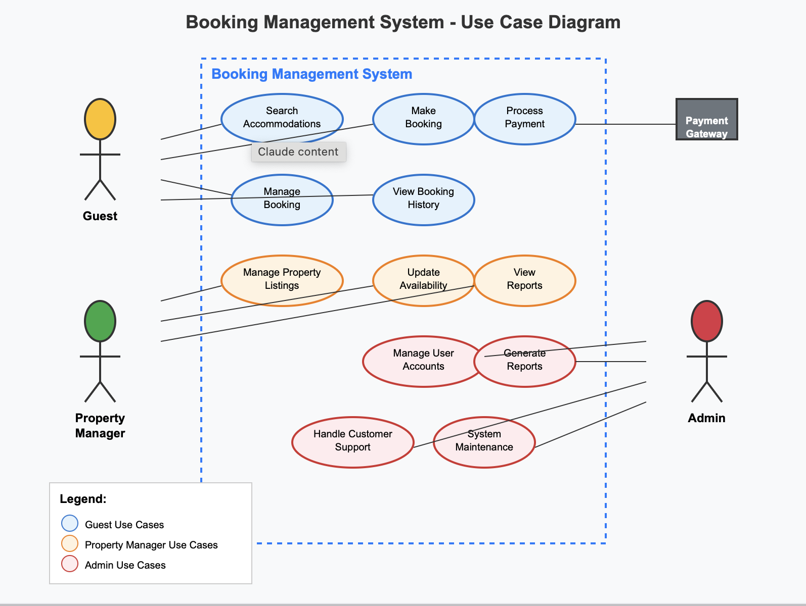

# Requirement Analysis in Software Development

Welcome to the Requirement Analysis project repository.  
This repository is dedicated to documenting the requirement analysis phase of a Booking Management System.  
It aims to showcase how to gather, analyze, and define both functional and non-functional requirements through structured documentation and visual diagrams.

---

## What is Requirement Analysis?

Requirement Analysis is the process of identifying, documenting, and managing the needs and expectations of stakeholders for a software system.  
It acts as a foundation for the development process by ensuring that the final product meets both user and business needs.  

In the Software Development Life Cycle (SDLC), requirement analysis helps to reduce misunderstandings, identify potential issues early, and align the project scope with stakeholders’ goals.

---

## Why is Requirement Analysis Important?

- **Clarifies Project Scope**: Defines clear boundaries and expectations for all stakeholders.
- **Reduces Development Risks**: Identifies potential problems early, reducing cost and time.
- **Ensures Product Quality**: Aligns the final product with user and business goals through structured validation.

---

## Key Activities in Requirement Analysis

- **Requirement Gathering**: Collecting raw data from stakeholders, surveys, and research.
- **Requirement Elicitation**: Actively engaging with stakeholders to understand their real needs.
- **Requirement Documentation**: Recording all gathered requirements clearly and unambiguously.
- **Requirement Analysis and Modeling**: Analyzing feasibility, conflicts, and visualizing through diagrams.
- **Requirement Validation**: Ensuring requirements are complete, consistent, and aligned with project goals.

---

## Types of Requirements

### Functional Requirements

Functional requirements describe what the system should do.

**Examples for the Booking Management System**:
- Users can create an account and log in.
- Users can book, cancel, and view reservations.
- Admins can manage bookings and user data.

### Non-functional Requirements

Non-functional requirements define how the system performs.

**Examples**:
- The system must respond to any booking action within 2 seconds.
- The application must be available 99.9% of the time.
- All data must be encrypted and follow GDPR compliance.

---

## Use Case Diagrams

Use Case Diagrams provide a visual representation of the system's functionality from a user's perspective.  
They help identify the actors (users or systems) and their interactions with various features.

---

## Acceptance Criteria

Acceptance Criteria define the conditions under which a software feature is considered complete and acceptable to the user.  
They help avoid ambiguity by establishing clear expectations.

**Example: Checkout Feature - Acceptance Criteria**

- User must be logged in to proceed to checkout.
- The system must validate payment information before submission.
- A confirmation email is sent after successful checkout.
- All booked items are removed from the cart once checkout is complete.
- User is redirected to the Booking History page after confirmation.

---
